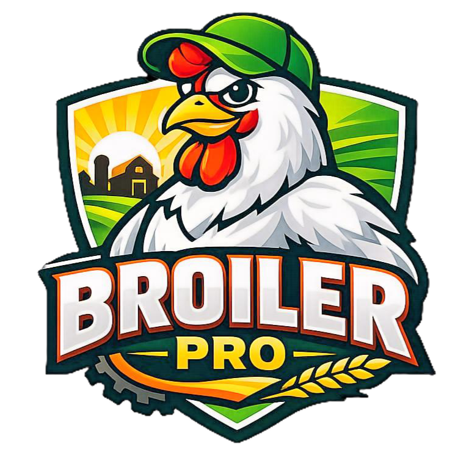

# 🎨 PWA Branding Update: BroilerPro

## 📅 Tanggal: 12 Mei 2026

## ✨ Perubahan

### 1. **Rebranding: BroilerTrack → BroilerPro**
- Nama aplikasi diubah dari "BroilerTrack" menjadi "BroilerPro"
- Tagline: "Manajemen Peternakan Ayam Broiler Profesional"

### 2. **Logo & Icon Baru**
- Logo baru: `icons/broiler-pro.PNG`
- Digunakan sebagai:
  - ✅ App icon (PWA installer)
  - ✅ Splash screen logo
  - ✅ Favicon
  - ✅ Apple touch icon
  - ✅ Manifest icons

### 3. **Splash Screen Redesign**

#### **Sebelum:**
```
┌─────────────────────┐
│                     │
│        🥚          │
│   BroilerTrack     │
│   Manajemen...     │
│                     │
└─────────────────────┘
```

#### **Sesudah:**
```
┌─────────────────────┐
│                     │
│   [LOGO BESAR]     │
│   BroilerPro       │
│   Manajemen...     │
│      ⏳            │
│                     │
└─────────────────────┘
```

**Fitur Baru:**
- Logo image (160x160px)
- Gradient background (biru)
- Loading spinner animasi
- Fade-in & scale animation
- Drop shadow pada logo

## 📁 File yang Diubah

### 1. **manifest.json**
```json
{
  "name": "BroilerPro - Manajemen Peternakan Ayam",
  "short_name": "BroilerPro",
  "icons": [
    {
      "src": "icons/broiler-pro.PNG",
      "sizes": "512x512",
      "type": "image/png",
      "purpose": "any"
    },
    {
      "src": "icons/broiler-pro.PNG",
      "sizes": "192x192",
      "type": "image/png",
      "purpose": "maskable"
    }
  ]
}
```

### 2. **index.html**
**Meta Tags:**
```html
<meta name="apple-mobile-web-app-title" content="BroilerPro" />
<title>BroilerPro - Manajemen Peternakan Ayam Broiler</title>
<link rel="icon" href="icons/broiler-pro.PNG" type="image/png" />
<link rel="apple-touch-icon" href="icons/broiler-pro.PNG" />
```

**Splash Screen:**
```html
<div id="splash" class="splash">
  <div class="splash-content">
    <div class="splash-logo">
      
    </div>
    <h1>BroilerPro</h1>
    <p>Manajemen Peternakan Ayam Broiler</p>
    <div class="splash-loader">
      <div class="loader-spinner"></div>
    </div>
  </div>
</div>
```

### 3. **css/style.css**
**Splash Screen Styles:**
```css
.splash {
  background: linear-gradient(135deg, #3B82F6 0%, #2563eb 100%);
}

.splash-logo {
  width: 160px;
  height: 160px;
  margin: 0 auto 20px;
  animation: scaleIn 0.5s ease-out;
}

.splash-logo img {
  width: 100%;
  height: 100%;
  object-fit: contain;
  filter: drop-shadow(0 8px 16px rgba(0,0,0,0.2));
}

.loader-spinner {
  width: 40px;
  height: 40px;
  border: 3px solid rgba(255,255,255,0.3);
  border-top-color: #fff;
  border-radius: 50%;
  animation: spin 0.8s linear infinite;
}

@keyframes scaleIn {
  from { opacity: 0; transform: scale(0.8); }
  to { opacity: 1; transform: scale(1); }
}

@keyframes spin {
  to { transform: rotate(360deg); }
}
```

### 4. **sw.js (Service Worker)**
```javascript
const CACHE_VERSION = 'broilerpro-v19';

const ASSETS = [
  // ... existing assets
  './icons/broiler-pro.PNG',
  // ...
];
```

## 🎨 Design Specifications

### **Logo Requirements**
- Format: PNG dengan background transparan (atau putih)
- Ukuran minimum: 512x512px
- Aspect ratio: 1:1 (persegi)
- File size: < 500KB untuk performa optimal

### **Color Palette**
- Primary: `#3B82F6` (Blue)
- Primary Dark: `#2563eb`
- Background: `#ffffff` (White)
- Text: `#1F2937` (Dark Gray)

### **Animations**
1. **Logo Scale-In**: 0.5s ease-out
2. **Content Fade-Up**: 0.6s ease-out
3. **Spinner Rotation**: 0.8s linear infinite

## 🚀 Deployment Checklist

- [x] Update manifest.json dengan logo baru
- [x] Update index.html meta tags & splash screen
- [x] Update CSS untuk splash screen
- [x] Update service worker cache
- [x] Tambah logo ke folder icons/
- [ ] Generate berbagai ukuran icon (72, 96, 128, 144, 152, 192, 384, 512)
- [ ] Test PWA install di berbagai device
- [ ] Test splash screen di iOS Safari
- [ ] Test splash screen di Android Chrome

## 📱 Testing Guide

### **Desktop (Chrome/Edge)**
1. Buka DevTools → Application → Manifest
2. Verify icon muncul dengan benar
3. Klik "Update on reload" untuk clear cache
4. Refresh halaman → Splash screen muncul

### **Mobile (iOS Safari)**
1. Buka di Safari
2. Tap Share → Add to Home Screen
3. Verify icon di home screen
4. Buka app → Splash screen muncul

### **Mobile (Android Chrome)**
1. Buka di Chrome
2. Tap menu → Install app
3. Verify icon di app drawer
4. Buka app → Splash screen muncul

## 🛠️ Generate Multiple Icon Sizes

### **Option 1: Manual (Photoshop/GIMP)**
1. Buka `broiler-pro.PNG`
2. Resize ke ukuran: 72, 96, 128, 144, 152, 192, 384, 512
3. Export sebagai PNG
4. Simpan ke folder `icons/`

### **Option 2: Online Tool**
1. Buka https://realfavicongenerator.net/
2. Upload `broiler-pro.PNG`
3. Generate semua ukuran
4. Download & extract ke folder `icons/`

### **Option 3: Using generate-icons.html**
1. Buka `generate-icons.html` di browser
2. Upload `broiler-pro.PNG`
3. Klik "Generate Icons"
4. Download semua ukuran
5. Simpan ke folder `icons/`

## 📊 Icon Sizes Needed

| Size    | Purpose                          | Priority |
|---------|----------------------------------|----------|
| 72x72   | Android small icon               | Medium   |
| 96x96   | Android medium icon              | Medium   |
| 128x128 | Chrome Web Store                 | Low      |
| 144x144 | Windows tile                     | Medium   |
| 152x152 | iOS iPad                         | High     |
| 192x192 | Android large icon (required)    | **High** |
| 384x384 | Android extra large              | Medium   |
| 512x512 | PWA splash screen (required)     | **High** |

## 🎯 PWA Install Prompt

Setelah update ini, saat user mengunjungi aplikasi:

1. **Desktop**: Banner "Install BroilerPro" muncul di address bar
2. **Mobile**: Prompt "Add BroilerPro to Home Screen" muncul
3. **Icon**: Logo broiler-pro.PNG ditampilkan
4. **Splash**: Saat buka app, splash screen dengan logo muncul

## 🐛 Troubleshooting

### **Icon tidak muncul setelah install**
```bash
# Clear cache & reinstall
1. Uninstall PWA dari device
2. Clear browser cache
3. Hard refresh (Ctrl+Shift+R)
4. Install ulang PWA
```

### **Splash screen tidak muncul**
```javascript
// Pastikan service worker sudah update
navigator.serviceWorker.getRegistrations().then(registrations => {
  registrations.forEach(reg => reg.update());
});
```

### **Logo terlalu besar/kecil**
```css
/* Adjust di style.css */
.splash-logo {
  width: 160px;  /* Ubah sesuai kebutuhan */
  height: 160px;
}
```

## 📝 Notes

1. **File Extension**: `broiler-pro.PNG` (uppercase PNG)
   - Pastikan case-sensitive di server Linux
   - Pertimbangkan rename ke `broiler-pro.png` (lowercase)

2. **Image Optimization**:
   - Compress PNG untuk performa lebih baik
   - Gunakan tool seperti TinyPNG atau ImageOptim

3. **Fallback Icons**:
   - `icon-192.png` dan `icon-512.png` tetap ada sebagai fallback
   - Jika `broiler-pro.PNG` gagal load, fallback ke icon lama

4. **Browser Support**:
   - Chrome/Edge: ✅ Full support
   - Safari iOS: ✅ Full support
   - Firefox: ✅ Full support
   - Samsung Internet: ✅ Full support

## 🔄 Rollback Plan

Jika ada masalah, rollback dengan:

```bash
# 1. Revert manifest.json
git checkout HEAD~1 manifest.json

# 2. Revert index.html
git checkout HEAD~1 index.html

# 3. Revert style.css
git checkout HEAD~1 css/style.css

# 4. Revert service worker
git checkout HEAD~1 sw.js

# 5. Clear cache
# User harus clear cache browser atau uninstall PWA
```

---

**Created by:** Kiro AI Assistant  
**Date:** 12 Mei 2026  
**Version:** 1.0.0  
**Status:** ✅ Ready for Production
